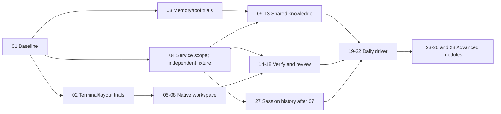

# Donwells Terminal Workspace Implementation Plan

> **For agentic workers:** Use superpowers:executing-plans to implement this plan task-by-task. Do not delegate or spawn subagents unless the user explicitly requests it. Steps use checkbox (`- [ ]`) syntax for tracking.

**Goal:** Deliver a distinctive, modular terminal workspace where multiple native agents share project knowledge and can build, inspect, test and package applications.

**Architecture:** Keep registered-project authority and native agent processes. Replace weak subsystems behind their existing boundaries, introduce selected external tools through scoped process/MCP integrations, and rebuild workspace layout around persistent session identities. Use one authoritative memory backend and separately rebuildable document/code indexes.

**Tech Stack:** Existing Electron 44, React 19, TypeScript 7, Zustand, node-pty, Monaco and Pierre; selected docking/terminal library after trials; Engram or SQLite/FTS5; QMD; codebase-memory-mcp; ripgrep; Playwright; selected Cua Driver/Peekaboo. Exact admitted versions are recorded in Task 01, not floated to latest.

**Spec:** [Product and architecture specification](../specs/2026-09-06-terminal-workspace-design.md).

## Global constraints

- Main dark surface is `#16161D`.
- Native CLI/TUI interaction is the primary agent interface.
- OMP, Hermes, DeepSeek Harness, and Kimi are first-class agents; arbitrary commands remain supported.
- Shared durable memory belongs to the project, including its registered Git worktrees.
- Both shared-checkout and isolated-worktree execution are available.
- No automatic pushes, pull requests, publishing or external messages.
- Preserve existing data, running sessions, safe file saves and undo during replacement.
- Prefer MIT/Apache components; review exact file/package boundaries and preserve notices.
- Use existing helpers before adding a parallel abstraction; adopt only the winning trial implementation.
- Planning is complete when the documents are reviewable. Production implementation is not authorized merely by writing this plan.

## How to execute

All paths below are relative to the execution Git root `/Users/muzikfirst/Documents/donwellsai/terminal-foundation`. Existing source baseline is `18eddb407008ae36bd157945987dd00e53cafa36`. Preserve dirty state at execution time. Use a local working branch and small local commits; do not move the user's current checkout without accounting for changes. No release promises based on the research snapshots.

For each task: read named source/tests and every caller of changed shared functions; add the smallest failing regression or live acceptance case; verify it fails for the intended reason; implement; run focused checks; review the diff; save evidence; make a local commit when the task is complete. Do not add tests for static copy/token edits. Commands below describe checks to run during execution, not tests run while planning.

A task finishes with working behavior, recorded evidence and its obsolete path removed or explicitly retained for bounded rollback. A blocker is recorded with the exact failing operation and next experiment. Optional-tool absence is a visible degraded state, not a failed terminal launch.

## Roadmap and dependencies

| Milestone | Tasks | Human-visible result | Gate |
|---|---|---|---|
| M0: choose and protect | 01–04 | Baseline evidence, selection results, scoped service foundation | No irreversible migration; winner/fallback named |
| M1: native workspace | 05–08 | Own visual identity, movable terminals, four agents and reliable status | Native session/input/recovery checks |
| M2: shared project knowledge | 09–13, 27 | Migrated memory, handoffs, docs/code search | Isolation, migration, freshness and recall gates |
| M3: build and verify | 14–18 | Preview automation, desktop control, review evidence, Git/tasks | Real browser/native workflows and target ownership |
| M4: daily-driver release | 19–22 | Discoverable tools, onboarding, portability, packaged reliability | Installed six-journey acceptance |
| M5: advanced capabilities | 23–26, 28 | Measured analytics, richer graph memory, isolated/remote work, language intelligence | Independent capability gates; no forced engine stack |



The diagram groups work for orientation; the numbered dependencies on each card are authoritative. Task 27 can follow Task 13 without blocking its Files/Code/Documents/Memory search.

Trials are bounded by evidence, not endless browsing. Run each against one shared corpus/workload. If the preferred tool fails a hard gate, evaluate the named fallback; if both fail, retain an adequate existing baseline where one exists. A missing capability remains blocked/unavailable with its failed gate and next experiment recorded; retaining a baseline does not satisfy an unmet requirement. Do not hold all work for a speculative framework rewrite.

## Shared contracts

Preserve existing `ProjectMemoryApi`, `ProjectMemoryProject`, `ProjectMemoryEntry`, `RunningAgent`, runtime RPC and child-process types. New contracts below are proposed, not implemented. Define them once in `src/shared/project-tools.ts` only as Tasks 04/11 consume them; use existing project resolution for the values.

```ts
export type ProjectToolScope = {
  projectKey: string
  checkoutPath: string
  indexKey: string // main-resolved checkout identity; never the shared memory key
}
export type ToolServiceState = {
  id: string
  status: 'stopped' | 'starting' | 'ready' | 'failed'
  version: string | null
  detail: string | null
}
export type ProjectSearchHit = {
  source: 'file' | 'code' | 'document' | 'memory' | 'session'
  id: string
  title: string
  excerpt: string
  path: string | null
  line: number | null
  revision: string | null
  indexedAt: string | null
  stale: boolean
}
```

Do not create a universal cross-provider numeric relevance score. UI groups results by source. Result IDs are namespaced by source and bound scope; direct lookup revalidates that scope. Query generations prevent late results crossing project switches. The broker binds its scope at creation; agent requests cannot choose another project. QMD collection names, graph index IDs and memory-bank names stay backend details.

Define handoffs in `src/shared/project-handoff.ts` when Task 10 starts:

```ts
export type ProjectHandoff = {
  id: string
  projectKey: string
  taskId: string | null
  fromSessionId: string
  toAgent: string | null
  checkoutPath: string
  sourceRevision: string | null
  goal: string
  summary: string
  openQuestions: string[]
  nextSteps: string[]
  changedFiles: string[]
  evidenceIds: string[]
  state: 'open' | 'accepted' | 'superseded'
  delivery: 'not-sent' | 'confirmed' | 'uncertain'
  revision: number
  acceptedBySessionId: string | null
}
```

Cap text/array sizes at parsers, check paths against project authority, and require expected revision plus an idempotency key for acceptance. Acceptance atomically claims the handoff for one receiving session; it does not prove delivery. Persist delivery separately: only an acknowledged native/tool path confirms it. A lost acknowledgment is uncertain and requires inspection before resend. Reuse existing validation/error conventions. Do not copy these fields into a second task system.

## Acceptance evidence to retain through replacement

Reuse the existing isolation, revision and terminal snapshot-ordering tests in `tests/project-memory.test.ts`, `tests/project-memory-mcp.test.ts` and `tests/terminal-bus.test.ts`; extend gaps rather than copying covered assertions.

Memory persistence acceptance must launch a writer subprocess, create a fixture decision through the supported API, terminate it, and launch a distinct reader process against the same temporary profile. Verify recall from a linked worktree, attribution/history preservation and absence from an unrelated project. Repeat with interruption at each migration boundary. Constructing a second service object in one process is only reopen coverage, never restart proof.

Then run the installed OMP→Hermes→Kimi→DSH live recall scenario and actual native input checks. Record process identities and observed responses. Unit fixtures do not prove native configuration, provider access or installed packaging.

## Task cards

**Strengthening pass, 2026-09-06:** Every unchecked task must be reverified and improved where current evidence exposes a gap. Historical receipts below are retained as history, not completion of this pass. Task 02 and native VoiceOver/additional-language testing are deferred by the user. Keep ordinary keyboard operation, contrast, focus and resizing checks. Commit verified chunks; after every completed task show all 28 statuses and immediately continue.

### Task 01: Baseline, dependency admission and recovery evidence

**Depends on:** None.

**Files:** Modify `package.json` only to add acceptance commands when the runner exists; create `docs/architecture/component-decisions.md`, `tests/acceptance/workspace-baseline.mjs`; use `tests/smoke.mjs`, `build/electron-builder.json`.

**Interfaces:** Consumes current app and research snapshots. Produces a pinned component decision record and an installed-build baseline; no production interface changes.

- [x] **Step 1:** Record checkout, dirty state, OS/hardware, installed artifact path, source/artifact hashes and actual user-data path. Use a temporary test profile; never benchmark by changing real project memory.
- [x] **Step 2:** Capture the six spec journeys in the current installed build, noting unsupported steps. Record input/focus latency, app/service RAM, idle CPU, startup and restart behavior separately from model resources.
- [x] **Step 3:** For each proposed dependency, record exact release, source SHA, checksum, runtime/model requirements, package licenses/notices, maintenance status, install/remove method and rollback. Fail admission on unresolved redistribution rights.
- [x] **Step 4:** Add the smallest Electron live runner around existing smoke infrastructure, with required `--app`, `--profile` and `--evidence` arguments pointing to the actual executable, disposable profile and evidence directory. Reuse `DONWELLS_USER_DATA`; do not enable `DONWELLS_SMOKE` for human journeys. The existing smoke runner launches developer Electron from node_modules and cannot by itself prove packaged acceptance. Record executable hash, source fingerprint and monotonic duration in each result.
- [x] **Verification:** Run `pnpm typecheck`, `pnpm test`, and `pnpm package:dir`. Launch the resulting artifact with the acceptance profile and save baseline results. Never report the packaged app as tested without launching it.
- [x] **Review and commit:** Inspect the focused diff, record source/artifact evidence and make a local task commit when complete. No push/PR.

**Rollback:** Remove only the temporary profile and trial artifacts. Keep all user data untouched.

**Strengthening evidence:** [current baseline and shipping-byte verification](../../architecture/strengthening-01/README.md). Task 01 strengthened; no other task marked complete.

### Task 02: SKIPPED by user — retain xterm/FlexLayout

**Depends on:** 01.

**Files:** Inspect `src/renderer/src/components/TerminalPane.tsx`, `Workbench.tsx`, `src/renderer/src/terminal-bus.ts`, `src/main/terminal-daemon.ts`; create `tests/acceptance/terminal-layout.mjs` and a disposable `experiments/terminal-layout/` trial.

**Interfaces:** Consumes existing attach/input/resize session API. Produces a recorded renderer/layout winner; the trial must not alter PTY ownership.

- [ ] **Step 1:** First compare xterm and Ghostty Web in the same minimal layout, then compare FlexLayout and Dockview with the winning renderer. Keep daemon session and workload identical so layout effects are not mistaken for renderer effects. Pin trial dependencies separately; keep production lockfile unchanged during comparison.
- [ ] **Step 2:** Exercise existing search, links, selection, custom key handlers, multiline paste, IME, VoiceOver, Unicode, mouse reporting, alternate screen and terminal resize. Record unsupported Ghostty APIs explicitly.
- [ ] **Step 3:** Move/split/focus views 100 times and prove identical daemon session/process identity, no duplicate subscriptions and unchanged editor unsaved content. Capture terminal frames and input latency under output load.
- [ ] **Step 4:** Choose the pair that passes every critical behavior and materially improves arrangement or measured performance. Reject a renderer with lost accessibility/addons. Record native Ghostty as a separate experiment if needed, not an assumed fallback.
- [ ] **Verification:** Run `pnpm exec vitest run tests/terminal-bus.test.ts tests/terminal-daemon.test.ts tests/editor-tabs.test.ts`. Run `node tests/acceptance/terminal-layout.mjs` after creating its documented profile arguments.
- [ ] **Review and commit:** Inspect the focused diff, record source/artifact evidence and make a local task commit when complete. No push/PR.

**Rollback:** Delete rejected trial code/dependencies. Retain the baseline renderer if no replacement passes.

**Open gates:** Native IME composition and VoiceOver speech/navigation are unverified. Completed comparison measurements are in [native terminal comparison](../../architecture/current-terminal-layout-native.json); [native-input blockers](../../architecture/current-terminal-native-input-gates.json) remain explicit. Task 02 is not complete.

### Task 03: Select memory, retrieval and control engines

**Depends on:** 01.

**Files:** Inspect `src/main/project-memory.ts`, `project-memory-store.ts`, `src/cli/project-memory-mcp.ts`; create `tests/acceptance/tool-candidates.mjs`, `tests/fixtures/project-knowledge.json`; extend `docs/architecture/component-decisions.md`.

**Interfaces:** Consumes the current ProjectMemoryApi and spec quality targets. Produces exact admitted tool versions and compatibility findings.

- [x] **Step 1:** Author 50 real project questions and known source references: exact decisions, paraphrases, conflicting/obsolete facts, worktree-specific code and unrelated-project traps. Keep synthetic fixtures separate from user memory.
- [x] **Step 2:** Compare Engram to current API semantics: revision conflicts, full history, archive, ID preservation, isolation, backup/import and offline behavior. If critical semantics need a second authoritative ledger, select SQLite/FTS5 behind the existing API instead.
- [x] **Step 3:** Exercise QMD local retrieval and codebase-memory-mcp on a temporary copy of this repository. Record first-index time, incremental edits/deletes, warm/cold retrieval, model downloads and resident memory.
- [x] **Step 4:** Trial Playwright MCP versus agent-browser for project-app testing and Cua Driver versus Peekaboo on a disposable native-app fixture. Score correct-target actions, interruption, background behavior and permission diagnosis. Pin one default in each category; keep others optional.
- [x] **Verification:** Run `pnpm exec vitest run tests/project-memory.test.ts tests/project-memory-mcp.test.ts`. Candidate evidence must include actual requests/results, not README benchmark numbers.
- [x] **Review and commit:** Inspect the focused diff, record source/artifact evidence and make a local task commit when complete. No push/PR.

**Rollback:** Uninstall trial tools only when installed into the trial directory; do not modify pre-existing user installations.

**Strengthening evidence:** [reconciled current selections and native service checks](../../architecture/strengthening-03/README.md).

### Task 04: Project-scoped tool lifecycle and service ownership

**Depends on:** 01.

Validate lifecycle with a harmless fixture service; real adapters require their own admission. Do not block this foundation on every Task 03 trial.

**Files:** Create `src/shared/project-tools.ts`, `src/main/project-tools.ts`, `tests/project-tools.test.ts`; modify `src/main/local-runtime.ts`, `src/main/runtime-rpc.ts` only to expose required operations. Reuse `src/shared/child-process/` and `src/main/secret-store.ts`.

**Interfaces:** Consumes canonical project resolution and existing process helpers. Produces ProjectToolScope/ToolServiceState and start/stop/status operations through existing runtime RPC.

- [x] **Step 1:** Create a bound scope before launching a tool. Separate canonical project key from checkout-specific index key; validate real paths and reject deregistered projects.
- [x] **Step 2:** Start one admitted service per required scope, wait for a real readiness response, cap log output, and maintain a bounded restart policy. Deduplicate simultaneous start requests. Expose minimal availability/error/retry controls now; Task 19 consolidates them. Bind requests to an unguessable launch credential or inherited private channel and fence stale service generations; localhost alone is not authentication.
- [x] **Step 3:** Bind the permitted memory/index/browser targets server-side. Reject override attempts for search, direct get, export, history and batch calls. Never trust harness attribution as identity.
- [x] **Step 4:** Test service crash, readiness timeout, malformed response, scope spoofing, duplicate starts and app shutdown. Retry read-only calls only; return uncertain write/action outcomes without automatic repetition.
- [x] **Verification:** Run `pnpm exec vitest run tests/project-tools.test.ts tests/runtime-rpc.test.ts tests/run-process.test.ts tests/secret-store.test.ts`.
- [x] **Review and commit:** Inspect the focused diff, record source/artifact evidence and make a local task commit when complete. No push/PR.

**Rollback:** Disable the added capability; running terminal agents remain usable. Stop only app-owned services.

**Strengthening evidence:** [scope preparation race, regression and native checks](../../architecture/strengthening-04.md).

### Task 05: Design tokens and a distinctive primary workspace

**Depends on:** 01. Task 02 skipped by user; retain xterm/FlexLayout.

**Files:** Modify `src/renderer/src/main.css`, `components/Workbench.tsx`, `WorktreeSidebar.tsx`, `RightSidebar.tsx`, `SettingsModal.tsx`; reuse `src/shared/appearance.ts` and `src/renderer/src/terminal-themes.ts`; create `tests/acceptance/workspace-accessibility.mjs`.

**Interfaces:** Consumes existing project/session state. Produces the spec workspace hierarchy and reusable appearance values; no replacement data store.

- [ ] **Step 1:** Style Focus, Pair, Build & Preview and Review compositions using existing terminal/editor/preview content; Task 06 implements their movement and saved arrangements. Use #16161D for the primary surface and establish measured text/control/focus contrast.
- [ ] **Step 2:** Put project, agent/session, checkout and attention near the work. Style secondary modules and their collapse/move affordances; Task 06 owns working movement and persistence. Use meaningful empty states with a direct action.
- [ ] **Step 3:** Implement keyboard navigation, visible focus, reduced motion and font scaling. Keep terminal palette independently configurable and never inject decorative output into native terminals.
- [ ] **Step 4:** Validate 1280×800 and larger windows plus 200% text scaling. Measure contrast and exercise currently available interactions with keyboard and VoiceOver; Task 21 owns the complete six journeys after their features exist. Static styling changes need visual checks, not snapshot-test boilerplate.
- [ ] **Verification:** Run `pnpm exec vitest run tests/settings-workspace.test.ts tests/workspace-navigation.test.ts`. Run the live accessibility script and record manual VoiceOver results.
- [ ] **Review and commit:** Inspect the focused diff, record source/artifact evidence and make a local task commit when complete. No push/PR.

**Rollback:** Restore the previous layout renderer behind the existing settings migration; keep session data intact.

### Task 06: Persistent movable modules and stable terminal views

**Depends on:** 05. Task 02 skipped by user; retain xterm/FlexLayout.

**Files:** Modify `components/Workbench.tsx`, `TerminalPane.tsx`, `EditorPane.tsx`, `src/renderer/src/store.ts`, `src/shared/settings.ts`; create `tests/workspace-layout.test.ts`.

**Interfaces:** Consumes the chosen layout library and current pane/session IDs. Produces versioned layout persistence referencing stable resource identities.

- [ ] **Step 1:** Integrate the winning docking library and terminal renderer using stable models and keys. Port required renderer addons, search and accessibility behavior; explicitly retain xterm if it wins. Deliver the movable preset compositions specified in Task 05. A panel location is not a process owner; moving it cannot invoke terminal stop.
- [ ] **Step 2:** Serialize layout with a schema version. Migrate existing split trees, preserve hidden panels and filter missing resources with a recoverable warning.
- [ ] **Step 3:** Implement focus, move, split, close-view and reopen commands through the existing command catalog. Make Stop process distinct from Close view.
- [ ] **Step 4:** Test corrupt saved layout, removed project, duplicate panel references, render remount, unsaved editor state and app restart. Remove the superseded split implementation once migration passes.
- [ ] **Verification:** Run `pnpm exec vitest run tests/workspace-layout.test.ts tests/terminal-bus.test.ts tests/editor-save.test.ts tests/editor-recovery.test.ts`; repeat the Task 02 live lifecycle workload.
- [ ] **Review and commit:** Inspect the focused diff, record source/artifact evidence and make a local task commit when complete. No push/PR.

**Rollback:** Keep one pre-migration layout backup. Reverting layout must not revert file contents or memory.

### Task 07: Four native agents and honest capability discovery

**Depends on:** 04, 06.

**Files:** Modify `src/shared/agent-runtime.ts`, `src/main/agents/registry.ts`, `src/main/agent-runtime.ts`, `src/main/agents/provider-hooks.ts`, `src/cli/project-memory-mcp.ts`; extend `tests/agent-discovery.test.ts`, `tests/agent-runtime.test.ts`; create `tests/acceptance/native-agent-matrix.mjs`.

**Interfaces:** Consumes admitted native agent versions and scoped service launch. Produces first-class OMP/Hermes/Kimi/DSH presets and preserved custom-command support.

- [ ] **Step 1:** Add explicit executable/argv handling while preserving existing command compatibility. Distinguish installed, launchable, authenticated, hook-supported and memory-connected states.
- [ ] **Step 2:** Generate project/launch scoped MCP overlays in each native format. Back up any managed file and preserve unknown/user-owned entries. Verify Hermes profiles and DSH overlays on actual selected releases.
- [ ] **Step 3:** Launch each real TUI, submit a benign project query, observe output, stop/resume using its supported native mechanism, and expose unsupported resume/status capability honestly.
- [ ] **Step 4:** Test spaces/non-ASCII paths, custom arguments, missing binary, invalid config, absent credentials, disconnect and process exit. Never substitute another agent or synthetic TUI on failure.
- [ ] **Verification:** Run `pnpm exec vitest run tests/agent-discovery.test.ts tests/agent-runtime.test.ts tests/agent-provider-hooks.test.ts tests/windows-command-line.test.ts`; record live results for all four agents.
- [ ] **Review and commit:** Inspect the focused diff, record source/artifact evidence and make a local task commit when complete. No push/PR.

**Rollback:** Remove only app-managed configuration entries and restore backups after checking user edits; leave existing native sessions and credentials intact.

### Task 08: Attention, reconnect and process lifecycle

**Depends on:** 06, 07.

**Files:** Modify `src/main/terminal-daemon.ts`, `src/main/agent-runtime.ts`, `src/shared/agent-presentation.ts`, `src/shared/command-catalog.ts`, `src/renderer/src/components/TerminalPane.tsx`; extend `tests/agent-daemon.test.ts`, `tests/terminal-daemon-ownership.test.ts`, `tests/attention-inbox.test.ts`.

**Interfaces:** Consumes native hook/liveness information. Produces accurate attention navigation, detach/stop behavior and recoverable terminal state.

- [x] **Step 1:** Add next-waiting-session command and readable reason. Native completion events and process exit remain distinct from verified task completion.
- [x] **Step 2:** Exercise closing/reopening the GUI, daemon loss, PID reuse, display sleep and output truncation. Fix shared replay/lifecycle defects once at their actual owner.
- [x] **Step 3:** If truncated raw output cannot reconstruct a TUI, select a tested snapshot/redraw strategy supported by the chosen engine. Display a recovery state rather than silently presenting corrupted output.
- [x] **Step 4:** Cancel pending reconnect when the user stops a session. Bound service restart attempts and show failed ownership/liveness checks explicitly. Reattachment must not automatically relaunch an exited native agent or resubmit its previous input.
- [x] **Verification:** Run `pnpm exec vitest run tests/agent-daemon.test.ts tests/terminal-daemon.test.ts tests/terminal-daemon-ownership.test.ts tests/attention-inbox.test.ts`; perform 20 app/service restart cycles.
- [x] **Review and commit:** Inspect the focused diff, record source/artifact evidence and make a local task commit when complete. No push/PR.

**Rollback:** Keep daemon protocol version compatibility or fail with an explicit upgrade-required state; never attach an ambiguous session.

**Strengthening evidence:** [current recovery, waiting navigation and packaged restart checks](../../architecture/strengthening-08/README.md). Physical workstation sleep remains a Task 21 hardware qualification limit; window visibility recovery was exercised.

### Task 09: Migrate durable project memory

**Depends on:** 03, 04, 07.

**Files:** Modify `src/main/project-memory-store.ts`, `src/main/project-memory.ts`, `src/shared/project-memory.ts`; create `src/main/project-memory-migration.ts`, `tests/project-memory-migration.test.ts`; extend `tests/project-memory.test.ts`, `tests/project-memory-mcp.test.ts`.

**Interfaces:** Consumes selected backend and existing ProjectMemoryApi. Produces one authoritative backend behind the same API with validated migration.

- [ ] **Step 1:** Add migration tests using actual schema-v1 fixtures: multiple projects, current/old revisions, archive state, missing/corrupt documents and maximum-length content.
- [ ] **Step 2:** Implement the eight-step migration protocol from the spec. Preserve IDs or an auditable bijection. Verify counts and content hashes before changing the active backend manifest.
- [ ] **Step 3:** Preserve conflict errors and provenance. Enforce project scope for every backend operation, including direct ID lookup. No runtime dual-write to the old JSON file.
- [ ] **Step 4:** Test a concurrent old-client write during migration, subprocess death at every cutover boundary, disk full, interruption before/after manifest switch, backend unavailable, duplicate migration and downgrade after new writes. Expose migration diagnosis and export without deleting the old backup.
- [ ] **Verification:** Run `pnpm exec vitest run tests/project-memory.test.ts tests/project-memory-migration.test.ts tests/project-memory-mcp.test.ts`; run the live four-agent recall matrix against the migrated temporary profile.
- [ ] **Review and commit:** Inspect the focused diff, record source/artifact evidence and make a local task commit when complete. No push/PR.

Evidence: `docs/architecture/native-four-memory-sqlite-01.json` records the four native agents recalling one revision-2 SQLite decision after a packaged app restart. The full 378-test run includes the named memory suites. Disk-full qualification and the other unchecked implementation gates remain outstanding.

**Rollback:** Before cutover reopen original data; after cutover export/reverse-migrate new writes. Never silently restore an outdated backup.

### Task 10: Explicit handoffs and project knowledge UI

**Depends on:** 07, 09.

**Files:** Create `src/shared/project-handoff.ts`, `src/main/project-handoff.ts`, `tests/project-handoff.test.ts`; modify `components/ProjectMemoryEditor.tsx`, `components/RightSidebar.tsx`, existing runtime RPC and memory MCP endpoints.

**Interfaces:** Consumes ProjectHandoff contract and authoritative memory service. Produces save/list/accept/supersede operations and visible handoff review.

- [ ] **Step 1:** Render durable decisions separately from task handoffs and raw history. Show provenance, revision, source and corrected/superseded state.
- [ ] **Step 2:** Save the current goal, worktree/content fingerprint, changed files and unresolved issues. Evidence links remain optional until Task 17 provides them; qualify linking then. Present the outgoing summary for inspection; keep private reasoning and secrets out.
- [ ] **Step 3:** Accept with expected revision and idempotency key. Atomically claim the receiving native session, then track delivery separately through its supported input/tool path. Test a crash between claim/send/acknowledgment and an uncertain send; never blindly replay native terminal input.
- [ ] **Step 4:** Test two simultaneous acceptors, stale handoff after edits, missing source session, repeated acceptance and cross-project ID access. Agent failure cannot erase the outgoing handoff.
- [ ] **Verification:** Run `pnpm exec vitest run tests/project-handoff.test.ts tests/project-memory.test.ts`; demonstrate OMP→Hermes and Kimi→DSH continuation on one fixture task.
- [ ] **Review and commit:** Inspect the focused diff, record source/artifact evidence and make a local task commit when complete. No push/PR.

**Rollback:** Disable handoff UI without changing durable facts; accepted records remain exportable.

### Task 11: QMD project-document retrieval

**Depends on:** 03, 04.

**Files:** Create `src/main/project-documents.ts`, `tests/project-documents.test.ts`; extend `src/shared/project-tools.ts` and the existing MCP/RPC surfaces. Reuse current file-boundary validation.

**Interfaces:** Consumes scoped QMD service and selected document roots. Produces ProjectSearchHit document results and source retrieval bound to the same project.

- [ ] **Step 1:** Create checkout-specific collections for repository documents and explicitly shared collections for selected external project references, with explicit exclusions for secrets, binaries and generated output. Avoid indexing the whole home directory.
- [ ] **Step 2:** Use QMD indexing/search rather than implementing chunking/vector fusion. Share model residency where supported and show index progress, cancellation, model size and paused state.
- [ ] **Step 3:** Enforce scope on query, get and multi-get as well as discovery. Include resolvable source and index timestamp; reject references escaping the selected roots.
- [ ] **Step 4:** Test edited/deleted/renamed files, symlinks, non-ASCII paths, corrupt index, unavailable model and lexical fallback. Benchmark the authored 50-question corpus.
- [ ] **Verification:** Run `pnpm exec vitest run tests/project-documents.test.ts tests/filesystem-confinement.test.ts`; record QMD cold/warm retrieval and deletion results.
- [ ] **Review and commit:** Inspect the focused diff, record source/artifact evidence and make a local task commit when complete. No push/PR.

**Rollback:** Delete/rebuild derived indexes only; authoritative source documents and durable decisions remain untouched.

**Current evidence:** [document service qualification](../../architecture/current-document-service.md), [production corpus](../../architecture/current-document-production-corpus.json), [packaged worker](../../architecture/current-document-packaged-service.json). Uses the named LanceDB fallback with QMD chunking/local models after QMD standalone retrieval failed the frozen corpus. Existing native fusion is reused. Configuration/progress are available through the scoped service and agent MCP; interactive setup and unified search remain Tasks 19 and 13.

### Task 12: Code graph, ripgrep and structural search

**Depends on:** 03, 04.

**Files:** Modify `src/main/worktree-files.ts`, `src/shared/file-search.ts`; create `src/main/project-code-search.ts`, `tests/project-code-search.test.ts`; extend `tests/file-write.test.ts` only for unchanged boundary regression coverage.

**Interfaces:** Consumes checkout-specific scope and admitted ripgrep/code-index binary. Produces file/code ProjectSearchHit results; file-write APIs remain unchanged.

- [ ] **Step 1:** Return streaming/cancellable ripgrep results with proper ignore behavior; map existing showHidden/includeIgnored settings to explicit arguments. Use argv, not interpolated shell strings.
- [ ] **Step 2:** Build code indexes per checkout/revision. Route caller/impact questions to the existing code-index tool; offer ast-grep for structural queries without building a second parser.
- [ ] **Step 3:** Test nested .gitignore, ignored directories, hidden files, symlinks, large repositories, deleted files and cancellation. Keep root validation on every result open.
- [ ] **Step 4:** Verify known imports/callers and a rename across two diverged worktrees. Invalidate only affected indexes and label unsupported dynamic resolution.
- [ ] **Verification:** Run `pnpm exec vitest run tests/project-code-search.test.ts tests/filesystem-confinement.test.ts tests/workspace-navigation.test.ts`; benchmark the 100k-file fixture.
- [ ] **Review and commit:** Inspect the focused diff, record source/artifact evidence and make a local task commit when complete. No push/PR.

**Rollback:** Fallback to bounded existing discovery when tool unavailable; make loss of content/graph search visible.

**Evidence:** [Current code-search qualification](../../architecture/current-code-search-qualification.json), [100k-file measurements](../../architecture/current-code-search-scale.json), and Task 12 in [component decisions](../../architecture/component-decisions.md).

### Task 13: Unified search and source navigation

**Depends on:** 09, 11, 12.

**Files:** Create `src/renderer/src/components/ProjectSearch.tsx`, `tests/project-search.test.ts`; modify `src/shared/command-catalog.ts`, `components/RightSidebar.tsx`, existing editor/document navigation modules.

**Interfaces:** Consumes ProjectSearchHit results. Produces source-grouped search and safe open-at-location behavior.

- [ ] **Step 1:** Add Files, Code, Documents and Memory to one search entry. Enable Sessions when Task 27 becomes available, with a visible unavailable state until then; optional history support must not block core search. Show why each match appeared and its source/freshness.
- [ ] **Step 2:** Cancel obsolete queries and suppress responses from the previous project. Keep navigation focus and query text stable during result streaming.
- [ ] **Step 3:** Open files at line/revision where available, show missing/changed source clearly, and offer refresh for stale indexes. Do not attach entire result sets to an agent automatically.
- [ ] **Step 4:** Test slow-old/fast-new result ordering, project switch during query, missing files, pagination and keyboard navigation.
- [ ] **Verification:** Run `pnpm exec vitest run tests/project-search.test.ts tests/document-navigation.test.ts tests/editor-tabs.test.ts`; run keyboard-only source-to-agent workflow.
- [ ] **Review and commit:** Inspect the focused diff, record source/artifact evidence and make a local task commit when complete. No push/PR.

**Rollback:** Retain existing Quick Open shortcut until the unified path passes equivalent navigation checks.

### Task 14: Browser preview hosting migration

**Depends on:** 04, 06.

**Files:** Modify `src/main/index.ts`, `src/renderer/src/components/BrowserPane.tsx`, `BrowserHosts.tsx`, `src/renderer/src/browser-runtime.ts`, `src/main/browser-permissions.ts`; extend `tests/browser-runtime.test.ts`, `tests/browser-routing.test.ts`; replace `tests/browser-webview-smoke.cjs` with `tests/browser-view-smoke.cjs` after parity.

**Interfaces:** Consumes existing browser operations and project session identity. Produces main-owned WebContentsView preview with equivalent user operations.

- [ ] **Step 1:** Move guest webContents ownership to main. Preserve navigation/history and partition identity; renderer reports only validated bounds and user intent.
- [ ] **Step 2:** Handle native view bounds, clipping, z-order, menus, dialogs, popups, focus and hidden panes. Keep app chrome and previews visually consistent.
- [ ] **Step 3:** Port design capture and screenshot behavior through the existing authority path. Do not permit renderer-supplied arbitrary privileged browser commands.
- [ ] **Step 4:** Test project switch, tab close, browser crash, downloads, denied permissions and native views overlapping dialogs. Reuse the browser RPC regression suite.
- [ ] **Verification:** Run `pnpm exec vitest run tests/browser-runtime.test.ts tests/browser-runtime-rpc.test.ts tests/browser-routing.test.ts tests/browser-history.test.ts tests/design-capture.test.ts`; run `node tests/browser-view-smoke.cjs`.
- [ ] **Review and commit:** Inspect the focused diff, record source/artifact evidence and make a local task commit when complete. No push/PR.

**Rollback:** Preserve browser data partitions; rollback hosting code cannot delete profile data.

### Task 15: Agent browser automation and diagnostics

**Depends on:** 03, 04, 14.

**Files:** Create `src/main/project-browser-tools.ts`, `tests/project-browser-tools.test.ts`, `tests/acceptance/browser-build-loop.mjs`; extend existing design-capture/runtime APIs and service UI.

**Interfaces:** Consumes admitted browser-control tool and project-owned targets. Produces scoped inspect/action/trace operations and ProjectSearchHit-compatible source links where relevant.

- [ ] **Step 1:** Connect the selected tool to a known project preview or managed browser context. Prove target identity; show external-browser attachment explicitly.
- [ ] **Step 2:** Expose inspect, interact, screenshot, console/network and trace actions needed for app testing. Keep diagnostics optional and avoid launching duplicate browsers.
- [ ] **Step 3:** Bound action ownership per context. On timeout return uncertainty rather than replaying a submit/click. Fresh snapshots invalidate old element references where the tool requires it.
- [ ] **Step 4:** Run a fixture web app with a broken form, console error and layout issue. Have a native agent reproduce/fix it, then verify in the same identified target and save the trace.
- [ ] **Verification:** Run `pnpm exec vitest run tests/project-browser-tools.test.ts tests/browser-runtime-rpc.test.ts`; run `node tests/acceptance/browser-build-loop.mjs` with the fixture profile.
- [ ] **Review and commit:** Inspect the focused diff, record source/artifact evidence and make a local task commit when complete. No push/PR.

**Rollback:** Disable automation while retaining human preview. Close only managed contexts, not personal browser windows.

### Task 16: Native computer-control module

**Depends on:** 03, 04, 06.

**Files:** Create `src/main/project-computer-tools.ts`, `tests/project-computer-tools.test.ts`, `tests/acceptance/computer-control.mjs`; add the module to the workbench and service settings.

**Interfaces:** Consumes selected Cua Driver or Peekaboo CLI/MCP interface. Produces visible target attachment, ownership and interruptible action execution.

- [ ] **Step 1:** Show target app/window and required permissions before attachment. Keep standard native OS permission prompts; never silently request broad access on app launch.
- [ ] **Step 2:** Allow one active controller per target and visible release/stop. Support observation without competing action streams. Foreground keyboard/mouse/clipboard actions also require one desktop-wide lease, even for different target windows. Fence queued actions by lease generation. On controller crash, cancel or confirm termination of its action stream before reassignment; uncertain actions remain visible.
- [ ] **Step 3:** Exercise accessibility-first interactions and screenshot fallback on native and Electron fixtures. Measure whether background actions actually preserve user focus.
- [ ] **Step 4:** Test denied permissions, target closes/moves, stale coordinates, concurrent agent requests and stop during a long action. Never retry uncertain input automatically.
- [ ] **Verification:** Run `pnpm exec vitest run tests/project-computer-tools.test.ts`; run the real native/Electron fixture acceptance with explicit target selection.
- [ ] **Review and commit:** Inspect the focused diff, record source/artifact evidence and make a local task commit when complete. No push/PR.

**Rollback:** Detach and stop the app-owned tool process. Leave OS permissions and unrelated apps under user control.

### Task 17: Review, verification and artifact evidence

**Depends on:** 08, 10.

Browser trace attachment is an integration check after Task 15; basic run/test/build evidence must work before browser automation.

**Files:** Modify `src/main/diff-review.ts`, `diff-review-store.ts`, `src/shared/diff-review.ts`, `src/shared/operational-runs.ts`, `components/DiffReviewPanel.tsx`; create `tests/verification-evidence.test.ts`.

**Interfaces:** Consumes existing run/diff records and tool result artifacts. Produces revision-bound verification evidence visible alongside changed files.

- [ ] **Step 1:** Expose run/test/build using existing package scripts and process execution, with explicit cwd. Attach command, environment/tool versions without secrets, source fingerprint, exit status, timestamps and artifact hashes using existing run storage. Fingerprint tracked, dirty and relevant untracked inputs plus lockfiles/configuration, not only HEAD; record inputs before and after execution and mark changed-during-run results uncertain.
- [ ] **Step 2:** Link local build outputs to the same task; attach and qualify browser traces/screenshots once Task 15 is ready. Distinguish agent completion, test success, human review, packaged artifact and published state.
- [ ] **Step 3:** Mark evidence stale after relevant source edits. Re-run requests target the current checkout; do not replay from an old cwd silently.
- [ ] **Step 4:** Test missing artifacts, changed revision, killed tests, unknown exit, moved worktree and invalid artifact paths. Review images/logs as untrusted output.
- [ ] **Verification:** Run `pnpm exec vitest run tests/verification-evidence.test.ts tests/diff-review.test.ts tests/execution-lifecycle.test.ts`; complete fixture fix→review→replay.
- [ ] **Review and commit:** Inspect the focused diff, record source/artifact evidence and make a local task commit when complete. No push/PR.

**Rollback:** Keep existing diff annotations and results readable if optional traces are unavailable.

### Task 18: Tasks, shared-checkout coordination and Lazygit

**Depends on:** 07, 10, 17.

**Files:** Modify `src/main/orchestration.ts`, `src/main/git.ts`, `src/shared/operational-runs.ts`, `components/Workbench.tsx`; create `tests/project-task-coordination.test.ts`; reuse `src/main/skills.ts` for optional workflow instructions.

**Interfaces:** Consumes current project/worktree and task identity. Produces shared/isolated task launch, advisory file ownership and optional native Lazygit/Backlog.md modules.

- [ ] **Step 1:** Make shared checkout versus new/existing worktree an explicit launch choice. Label branch and overlapping task/file intent.
- [ ] **Step 2:** Offer Lazygit as a normal terminal command in the selected checkout. Do not intercept its Git state with a second mutation engine.
- [ ] **Step 3:** Admit Backlog.md only as the chosen task authority for an opted-in project; map IDs rather than duplicating editable task records. Add OpenSpec-compatible artifacts without imposing a new orchestration engine.
- [ ] **Step 4:** Test simultaneous edits/conflicts, task handoff, removed worktrees and optional-tool absence. Advisory ownership must not claim to enforce filesystem locks against native agents.
- [ ] **Verification:** Run `pnpm exec vitest run tests/project-task-coordination.test.ts tests/git.test.ts tests/worktree-lineage.test.ts tests/worktree-retirement.test.ts`; demonstrate conflict review without data loss.
- [ ] **Review and commit:** Inspect the focused diff, record source/artifact evidence and make a local task commit when complete. No push/PR.

**Rollback:** Disable task integration while preserving task files; never delete worktrees to make a failed task disappear.

### Task 19: Tool catalog, setup doctor and resource controls

**Depends on:** 04, 07, 11, 15, 16.

**Files:** Modify `components/SettingsModal.tsx`, `src/main/skill-package-source.ts`, `skill-package-manifest.ts`, `src/main/secret-store.ts`; create `src/main/project-doctor.ts`, `tests/project-doctor.test.ts`.

**Interfaces:** Consumes admitted component records and live service status. Produces project enable/install/disable/status and actionable diagnosis.

- [ ] **Step 1:** List only integrated capabilities by default, with exact version, source, access scope, installation size and model requirements. Registry discovery does not execute installations.
- [ ] **Step 2:** Generate reversible native configuration changes with backup/diff. Protect user edits and redact credentials from diagnosis/export.
- [ ] **Step 3:** Add pause/resume indexing, stop service and retry readiness actions. Show provider usage only when known, estimates labeled, and native CLI auth unchanged.
- [ ] **Step 4:** Test missing binary, wrong version, corrupt config, port collision, disk shortage, no network and revoked permissions. A repair action must recheck the actual failed operation.
- [ ] **Verification:** Run `pnpm exec vitest run tests/project-doctor.test.ts tests/skill-packages.test.ts tests/secret-store.test.ts tests/settings-workspace.test.ts`.
- [ ] **Review and commit:** Inspect the focused diff, record source/artifact evidence and make a local task commit when complete. No push/PR.

**Rollback:** Disable a project tool without uninstalling shared user software or deleting its data.

### Task 20: Portable project kit and backup/restore

**Depends on:** 09–13, 18, 19.

**Files:** Create `src/main/project-export.ts`, `tests/project-export.test.ts`; extend `src/cli/index.ts`, `src/cli/arguments.ts` and project settings.

**Interfaces:** Consumes authoritative memory/task/layout/config data. Produces a versioned export with manifest, checksums and redacted portable references.

- [ ] **Step 1:** Export current facts/history/handoffs, selected task artifacts, layout and tool version manifest. Exclude secrets, auth cookies and machine-specific credential values.
- [ ] **Step 2:** Import into a new project only after validating schema, checksums, resource sizes and path traversal. Map project identity explicitly; do not merge on folder-name coincidence.
- [ ] **Step 3:** Show unsupported tools and stale evidence after import. Rebuild code/document indexes instead of packaging opaque machine-bound cache files by default.
- [ ] **Step 4:** Test interrupted export, corrupt archive, duplicate IDs, missing tool, import twice and successful restore to a clean profile.
- [ ] **Verification:** Run `pnpm exec vitest run tests/project-export.test.ts tests/cli.test.ts tests/project-memory-migration.test.ts`; restore and query the exported project in a second clean profile.
- [ ] **Review and commit:** Inspect the focused diff, record source/artifact evidence and make a local task commit when complete. No push/PR.

**Rollback:** Abort import before activation on validation failure; keep the destination existing project unchanged.

### Task 21: Daily-driver performance and accessibility qualification

**Depends on:** 05–20, 27.

**Files:** Extend `tests/acceptance/workspace-baseline.mjs`, `workspace-accessibility.mjs`, `terminal-layout.mjs`, `native-agent-matrix.mjs`; modify only bottleneck-owning source identified by evidence.

**Interfaces:** Consumes complete M1–M3 build. Produces comparable performance, recall, accessibility and recovery evidence.

- [ ] **Step 1:** Run all six journeys on the actual Mac with four native agents and the fixed corpus. Separate provider/model wait from host latency.
- [ ] **Step 2:** Check every spec target, 100 pane moves, 20 restarts, stale retrieval, write conflicts, service crashes and index cancellation. Verify no long-lived orphan processes.
- [ ] **Step 3:** Run keyboard/VoiceOver/font-scale/reduced-motion checks with real terminal content. Fix critical failures before polishing secondary animations.
- [ ] **Step 4:** Profile failed targets and fix shared causes. Record retained limitations with a concrete user-visible fallback; do not mark blocked capabilities available.
- [ ] **Verification:** Run `pnpm typecheck` and `pnpm test` once after fixes, then the affected live acceptance runners. Re-run broader suites only when changes justify them.
- [ ] **Review and commit:** Inspect the focused diff, record source/artifact evidence and make a local task commit when complete. No push/PR.

**Rollback:** Revert individual regressions without reverting migrated data. Preserve evidence of the failure and fix.

### Task 22: Installed release, update and recovery proof

**Depends on:** 20, 21.

**Files:** Modify `build/electron-builder.json`, `scripts/check-package.mjs`, `package.json`, `README.md`; add third-party notices at the existing notice location or create `THIRD_PARTY_NOTICES.md` if absent; extend packaging acceptance.

**Interfaces:** Consumes accepted component manifests and qualification results. Produces a locally installable, verified artifact with complete dependencies/notices.

- [ ] **Step 1:** Bundle or deliberately provision each selected native binary, WASM asset, SQLite extension and model; show optional downloads with size/checksum and offline behavior.
- [ ] **Step 2:** Build the local artifact with current packaging commands. Validate signing/notarization when credentials exist; otherwise report unsigned status explicitly without publishing.
- [ ] **Step 3:** Install into a controlled acceptance location/profile and complete all six journeys. Verify hash/source relation, cold launch, updates/rollback, memory persistence and no dependence on developer node_modules.
- [ ] **Step 4:** Write release notes from actual changes and evidence. Offer a concrete local artifact for user review; no automatic push, PR or public release.
- [ ] **Verification:** Run `pnpm package:mac`, then `pnpm package:check` against the produced package inputs; use the actual produced artifact path from tool output, not a guessed versioned filename. Record installed acceptance results.
- [ ] **Review and commit:** Inspect the focused diff, record source/artifact evidence and make a local task commit when complete. No push/PR.

**Rollback:** Keep the previous binary and compatible data export. A binary downgrade must honor Task 09 migration rules.

### Task 23: Analytics and richer learned/temporal memory

**Depends on:** 22.

**Files:** Create `docs/architecture/advanced-memory-evaluation.md`; if admitted add `src/main/project-analytics.ts` and `tests/project-analytics.test.ts`; extend project-tools only for selected services.

**Interfaces:** Consumes revision-bound local events and memory exports. Produces optional analytics and a measured learned-memory capability, not a replacement by assertion.

- [ ] **Step 1:** Evaluate DuckDB against existing SQLite aggregation on real session history for cost trends, test outcomes and resource usage. Use read-only exports/snapshots of the operational store.
- [ ] **Step 2:** Compare Hindsight, Graphiti and LightRAG on authored temporal/conflicting-fact and document-relation questions. Include extraction cost, correction/deletion behavior, time to first useful result and local-model compatibility.
- [ ] **Step 3:** Admit at most one richer-memory engine per selected deployment profile; retain explicit provenance and project isolation. Use LadybugDB only when an embedded graph requirement and maintained driver are proved.
- [ ] **Step 4:** If no candidate exceeds the simpler retrieval baseline on useful questions, retain the evaluation record and ship analytics without a second memory engine.
- [ ] **Verification:** Run the same 50-question baseline plus temporal cases; publish measured quality/latency/resource comparison. If analytics is implemented, run `pnpm exec vitest run tests/project-analytics.test.ts`.
- [ ] **Review and commit:** Inspect the focused diff, record source/artifact evidence and make a local task commit when complete. No push/PR.

**Rollback:** Remove derived analytical/experimental indexes without touching authoritative memory; export corrections before disabling an adopted memory authority.

### Task 24: Isolated desktops and remote workspaces

**Depends on:** 16, 22.

**Files:** Create `docs/architecture/remote-isolated-work.md`; after local-VM admission create `src/main/isolated-workspace.ts`, `tests/isolated-workspace.test.ts`; extend existing runtime RPC only with verified remote capabilities.

**Interfaces:** Consumes project exports and scoped tool manifests. Produces optional isolated desktop work and a separately qualified remote runtime.

- [ ] **Step 1:** Use Cua/Lume for a disposable local desktop where supported. Mount or copy only the selected project and explicit tool configuration, not home-directory secrets.
- [ ] **Step 2:** Prove native control, artifact return, pause/stop, VM resource limits and cleanup. Preserve user-created outputs before destruction.
- [ ] **Step 3:** Design remote host pairing with authenticated transport, explicit project mapping and capability/version negotiation. Do not pretend existing local RPC is remote-ready.
- [ ] **Step 4:** Test disconnect during a write/action, repeated reconnect, remote process ownership, source revision divergence and selective artifact import. No automated remote/public exposure.
- [ ] **Verification:** Run VM and remote checks separately; `pnpm exec vitest run tests/isolated-workspace.test.ts` covers state transitions only, not actual VM proof.
- [ ] **Review and commit:** Inspect the focused diff, record source/artifact evidence and make a local task commit when complete. No push/PR.

**Rollback:** Detach remote/VM service and retain artifact export; destroy only explicitly disposable instances.

### Task 25: Language intelligence and reusable project workflows

**Depends on:** 22.

**Files:** Modify `components/EditorPane.tsx`, existing skills/catalog and project creation modules; create `tests/language-tools.test.ts` only when language-server integration is added.

**Interfaces:** Consumes Monaco models, selected project runtime and existing skills mechanism. Produces optional diagnostics/navigation and portable project workflows.

- [ ] **Step 1:** Evaluate language-server integration for the project languages actually used; start with TypeScript diagnostics/navigation. Keep editor model/URI identity tied to its checkout.
- [ ] **Step 2:** Extend the run/test/build controls delivered in Task 17 with language-specific diagnostics and declared tool requirements. Core app-building commands must already work before release; do not defer them to this advanced milestone.
- [ ] **Step 3:** Offer spec/task/skill bundles as versioned project choices with visible contents. Preserve user-authored instructions and prevent imported docs from escalating tool access.
- [ ] **Step 4:** Test stale diagnostics after edits, switching worktrees, missing language server, crash recovery and undo/save continuity.
- [ ] **Verification:** Run `pnpm exec vitest run tests/language-tools.test.ts tests/editor-save.test.ts tests/editor-recovery.test.ts tests/skill-packages.test.ts` only after the new language test exists; perform real navigation/diagnostics checks.
- [ ] **Review and commit:** Inspect the focused diff, record source/artifact evidence and make a local task commit when complete. No push/PR.

**Rollback:** Disable language/workflow module without losing text models, source files or project scripts.

### Task 26: Desktop framework and native-terminal challenger

**Depends on:** 01, 22.

**Files:** Create disposable `experiments/native-shell/` and `docs/architecture/desktop-framework-comparison.md`; no production framework migration until the comparison passes.

**Interfaces:** Consumes installed Electron baseline and exact six journeys. Produces an evidence-based keep/migrate decision with a separate migration plan if justified.

- [ ] **Step 1:** Build the same thin workflow in Electrobun/Tauri or a native Ghostty host, choosing candidates from the current admitted snapshots. Account for main-process runtime/API differences.
- [ ] **Step 2:** Compare installed startup, idle/four-session RAM, input latency, browser fidelity, accessibility, update size and native dependencies. Include retrieval/control services in both sides equally.
- [ ] **Step 3:** Reject a smaller empty shell as an invalid comparison. Require recovery, safe saves, memory access and packaging parity.
- [ ] **Step 4:** If a challenger wins materially, write a concrete service/browser/packaging migration plan before replacing Electron. Otherwise delete the experiment and keep its measurements.
- [ ] **Verification:** Run the same Task 21 acceptance workload on each installed candidate. No production migration is credited from README size claims.
- [ ] **Review and commit:** Inspect the focused diff, record source/artifact evidence and make a local task commit when complete. No push/PR.

**Rollback:** Delete the trial shell; current installed artifact and user data remain unchanged.

### Task 27: Native session history and AgentsView integration

**Depends on:** 03, 04, 07, 13. Runs in M2 after core search; enables its optional Sessions category.

**Files:** Create `src/main/project-session-history.ts`, `tests/project-session-history.test.ts`; extend `src/shared/project-tools.ts` and existing runtime RPC. Reuse the Task 13 source-provider path to enable Sessions; modify `src/renderer/src/components/ProjectSearch.tsx` and extend `tests/project-search.test.ts` for this integration. Add AgentsView to the component admission record before using it.

**Interfaces:** Consumes native agent session roots resolved by the selected history tool and current project scope. Produces `ProjectSearchHit` with `source: 'session'`; archived transcript data remains read-only and separate from memory.

- [ ] **Step 1:** Compare AgentsView's parsers against the four admitted native agent versions. Record supported discovery/search/resume separately; do not invent compatibility for an unsupported log format.
- [ ] **Step 2:** Index only selected project sessions, with explicit source provenance and deletion policy. Do not import the user's entire home-wide history by default.
- [ ] **Step 3:** Return project-scoped snippets and open the original session with its supported native command. Treat transcript text as untrusted and never convert it automatically into durable facts.
- [ ] **Step 4:** Test renamed project paths, duplicate session IDs across agents, malformed/partial logs, deleted sessions, changed parser versions and cross-project direct lookup.
- [ ] **Verification:** Run `pnpm exec vitest run tests/project-session-history.test.ts tests/project-search.test.ts` once both files exist. Compare displayed history against real native sessions for every supported agent; unsupported parsers display an explicit capability message.
- [ ] **Review and commit:** Record the selected tool/version, parser coverage and focused evidence; make a local commit.

**Rollback:** Disable the derived archive and retain the original native conversation files unchanged.

### Task 28: Optional ACP capabilities and additional agent adapters

**Depends on:** 07, 19, 22. Runs in M5; the native four-agent workflow does not depend on ACP.

**Files:** Extend `src/shared/agent-runtime.ts`, `src/main/agents/registry.ts`, `src/main/agents/provider-hooks.ts`; create `tests/agent-capabilities.test.ts`. Add `src/main/agents/acp-client.ts` only if an admitted agent requires a real ACP client beyond its existing native integration.

**Interfaces:** Consumes the existing agent registry, scoped tool configuration and admitted protocol versions. Produces capability-specific structured operations without changing native terminal ownership or session identity.

- [ ] **Step 1:** Select one actually supported additional agent/protocol pair and document exact lifecycle, session identifiers, permissions, cancellation and resume behavior from its implementation.
- [ ] **Step 2:** Use maintained protocol/client packages where compatible; preserve terminal launch as the default. Expose structured features only when negotiated and proved.
- [ ] **Step 3:** Test schema/version mismatch, partial capability support, reconnect, canceled operations and permission requests; avoid starting a hidden second agent to simulate unsupported features.
- [ ] **Step 4:** Add other agents through native executable/config adapters using the same evidence matrix. No claim of universal ACP support merely because the app can start a command.
- [ ] **Verification:** Run `pnpm exec vitest run tests/agent-capabilities.test.ts tests/agent-discovery.test.ts tests/agent-runtime.test.ts`; demonstrate the structured feature and unchanged native TUI on the selected agent.
- [ ] **Review and commit:** Update capability documentation and local evidence; make a local commit.

**Rollback:** Disable the optional structured adapter; native terminal launch and original session files continue to work.

## Selection scorecard

Hard gates precede scoring: license admission, no data loss, project isolation, native TUI fidelity, accessibility and recoverability. A candidate failing one cannot win on speed or appearance.

For candidates passing those gates, score each 0–5 against the same workload: user workflow fit (30%), reliability and recovery (25%), integration/maintenance burden (20%), measured performance/resources (15%), extensibility and portability (10%). Record raw measurements and reasons beside the score. Do not hide uncertainty behind decimals or treat this as a benchmark of overall project quality.

A materially better terminal/framework candidate must improve a documented bottleneck while preserving all required behavior. The baseline remains a legitimate winner. A selected tool should let us delete a custom implementation or deliver a missing capability; similarity of feature lists is insufficient.

## Risk register and concrete responses

| Risk | Detect in | Response |
|---|---|---|
| Engram cannot preserve revisions/history | 03, 09 | Select SQLite/FTS5 behind existing API; reuse protocol, not a second writable ledger |
| Agent claims MCP support but project config leaks | 07, 09 | Bind project scope at server; validate all methods; refuse global hard-coded project config |
| Graph combines diverged worktrees | 12 | Checkout-specific index keys and source revisions; shared memory key stays separate |
| New terminal loses search/IME/VoiceOver | 02 | Reject replacement until parity; do not accept a pretty demo as proof |
| Docking remount loses state | 02, 06 | Stable keys/model and session ownership outside views; repeat 100 moves |
| Browser native view obscures app UI | 14 | Test z-order/bounds with menus/dialogs; external preview remains explicit fallback |
| Multiple agents race over the same desktop | 16 | Per-target ownership and visible stop; separate contexts/desktops when necessary |
| Local retrieval models consume too much memory | 03, 11, 19 | Shared residency, pause/unload, lexical mode and visible resource budget |
| Tool package changes behavior/license | 01, 19, 22 | Exact release/checksum; read package notices and re-run capability checks on upgrades |
| New-write data lost on rollback | 09, 20 | Reverse migration/export after cutover; never switch back to stale JSON |
| Agent completion mistaken for successful build | 17, 22 | Revision-bound results and separate installed-artifact state |
| Endless feature accumulation | Every admission | Require a user journey, named owner and acceptance result; avoid simultaneous equivalent stacks |

## Requirements coverage

| Requirement | Tasks |
|---|---|
| Distinct #16161D interface, ergonomic modules | 02, 05, 06, 21 |
| Four native agents plus arbitrary CLI | 07, 08, 28 |
| Same project, shared or isolated files | 04, 07, 18 |
| Shared project memory and migration | 03, 04, 09 |
| Cross-agent handoffs | 10, 18 |
| Document RAG and code graphs | 11, 12, 13, 23 |
| SQLite/DuckDB/vector/graph choices | 03, 09, 11, 23 |
| Better browser and computer control | 14, 15, 16, 24 |
| Editor/diffs/search/Git | 12, 13, 17, 18, 25 |
| Tools/skills/registry and setup | 04, 19, 25, 28 |
| Session history | 27, 13 |
| Backup, portability and recovery | 08, 09, 20, 22 |
| Verification and app-building loop | 15, 17, 21, 22 |
| Analytics, temporal memory, remote/native challengers | 23–26 |

## Execution status

Current position: **Task 09 active — durable project memory migration.** Tasks 01, 03, 04, 05, 06, 07 and 08 are strengthened. Task 02 remains skipped by explicit user instruction. Tasks 09–28 remain reopened; preserve existing implementation and continue the plan.

[Full execution checklist](2026-09-06-terminal-workspace-todo.md). After completing each task, show all 28 statuses and evidence before advancing. Task 27 precedes Task 21.

Task 01 complete: [six-journey baseline and unsupported portions](../../architecture/current-baseline-journeys.md), ten process-cold launches, 200 focused-terminal keyboard samples, 400 output samples, 200 tab samples, app/daemon/four-agent resources, crash recovery, exact artifact records and explicit admission rejections. Typecheck, 403 tests and packaged build/launch passed; three optional tests skipped. Measurement limitations remain explicit. This is baseline completion, not completion of the unsupported journeys or permission to install rejected tools.

## First execution batch

Start with Tasks 01–04, then 05–10 plus the applicable search/history tasks. Produce a local build in which OMP and Hermes run in movable panes and exchange one durable project decision through the admitted backend; verify Kimi and DSH on the same interface before declaring multi-agent support complete. This first complete slice establishes the foundations for richer retrieval and browser/native verification.

The full roadmap remains the target. Milestones control integration risk; they do not reduce the requested ambition. No estimated calendar dates are asserted before the compatibility trials establish effort. Review capacity and measured progress after M0, then schedule the remaining tasks from actual dependencies.

## Second-pass review corrections

- Corrected dependency gates: service lifecycle can start with a fixture; document retrieval is independent of memory migration; core search precedes optional history; computer UI waits for layout; migration live checks wait for native adapters. Basic build verification precedes browser automation.
- Assigned terminal renderer integration to Task 06 and core run/test/build controls to Task 17. Complete six-journey acceptance belongs to Task 21, not the early styling task.
- Replaced duplicated example tests and false restart wording with existing regression coverage plus true subprocess and installed-agent acceptance.
- Tightened write-safe migration, handoff claim/delivery semantics, dirty-source evidence, checkout identity, foreground control ownership and retention rules in this plan and its specification.
- Made installed acceptance explicitly select the packaged executable and temporary profile. No unit test, developer Electron launch or source inspection is credited as installed proof.

Tasks 23–26 are gated evaluation/design work followed by implementation of admitted outcomes. Remote transport and any new memory authority need a concrete follow-on implementation design after those trials; these cards do not claim those uncertain integrations are already implementation-ready. The full capability roadmap remains in scope.

## Plan completion check

- [ ] Current source baseline and actual nested Git root identified.
- [ ] Preferred components, challengers and selection rules recorded.
- [ ] Current data/state boundaries preserved in the proposed architecture.
- [ ] Migration, rollback, service failure and project-isolation rules specified.
- [ ] Every product requirement mapped to task ownership and acceptance.
- [ ] Source/test paths grounded in this checkout; new paths explicitly identified as proposed.
- [ ] Research claims separated from unperformed runtime qualification.
- [ ] Production code, dependencies, native agent settings and user data unchanged by planning.

Implementation task boxes remain unchecked. No task is complete because its plan exists.
