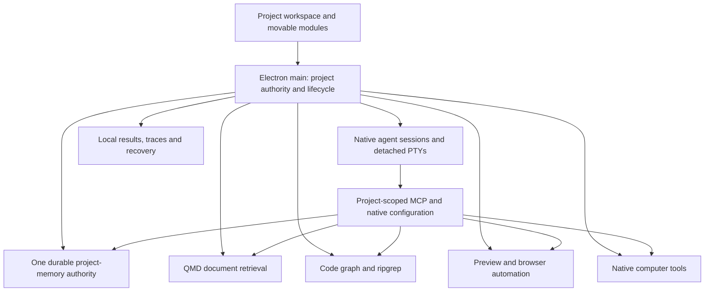

# Donwells: terminal-first app-building workspace

Status: proposed product and architecture specification, prepared at user request. Implementation authorized; baseline work started. Product replacements remain unimplemented. Source baseline: `18eddb407008ae36bd157945987dd00e53cafa36`.

## 1. The product

A comfortable workspace where you build applications with your preferred terminal agents. Open OMP, Hermes, DeepSeek Harness, Kimi, or another executable; use them on the same project, together or in sequence; keep the project's knowledge and development tools with the project.

The ambition is a complete development loop with a restrained interface. More capability should come from composable tools and clear workflows, not from filling the screen with dashboards. The app's identity comes from terminal-first interaction, calm materials, excellent arrangement and continuity between agents.

### Non-negotiable requirements

- Main dark surface is `#16161D`.
- Native CLI/TUI interaction is the primary agent interface.
- OMP, Hermes, DeepSeek Harness, and Kimi are first-class agents; arbitrary commands remain supported.
- One project can run multiple agents concurrently or hand work between agents.
- Shared durable memory belongs to the project, including its registered Git worktrees.
- Native conversations remain native; shared memory does not imply shared model state or interchangeable transcripts.
- Both shared-checkout and isolated-worktree execution are available.
- Every essential workspace action is keyboard accessible; terminal input retains its expected shortcuts.
- Prefer MIT/Apache components. Check exact package/file terms and preserve notices before redistribution.
- Build locally first; no compulsory account, hosted memory, cloud orchestration or remote telemetry.
- No automatic pushes, pull requests, publishing or external messages.
- Preserve existing data, running sessions, safe file saves and undo during replacement.
- Measure installed human workflows; a passing unit test or visible mockup is not completion.

### Planning assumptions

macOS on Apple Silicon is the first acceptance platform because it is the current workspace. Preserve the current cross-platform architecture and explicit capability reporting; Windows/Linux support must be tested separately and must not be advertised based only on a macOS result. Local models and paid provider CLIs are both supported; the app does not bypass provider authentication or promise unlimited compute. Model and native-tool downloads are visible and cancellable.

## 2. The experience

### Primary workspace

A compact project selector anchors the window. A session strip names the real agent and task; its status identifies live, waiting, failed or disconnected state. The large center holds movable terminal groups. Files, editor, diffs, preview, search, project knowledge, tasks, history and diagnostics are modules that can be shown, hidden, split, focused and relocated.

Initial arrangements: Focus (one main session), Pair (two sessions), Build & Preview (terminal plus app preview), and Review (diff plus terminal). These are editable presets, not separate modes with incompatible data. Closing a view detaches it; stopping a process is a separate, explicit operation. Reopening a session reattaches to its existing process when available.

Project context remains visible: project name, checkout/branch, and whether sessions share files. An attention command cycles to the next session needing input. No pulsing animation for idle sessions. Status color is supplemented with text/icons. Activity indicators come from native hooks when available; otherwise the app says what it actually observed.

### Identity and accessibility

Use `#16161D` as the primary field, slightly lifted neutral surfaces for tools, restrained borders, readable warm-neutral text, and one restrained accent family. Agent colors may identify sessions but may not be the only identifier. Prototype accent candidates with the actual terminal palette; final contrast is measured, not guessed. Minimum text contrast targets are 4.5:1 for ordinary text and 3:1 for large text; visible controls/focus boundaries target 3:1. Respect reduced motion and font scaling. Preserve keyboard layout, Option-word navigation, IME composition, clipboard and VoiceOver behavior.

Settings should explain user effects: memory location, agent availability, browser ownership, model download size, and what a tool can access. Internal protocol names belong in advanced details, not the everyday flow.

### Six complete journeys

1. **Start:** choose an existing folder or create a project; detect agents; launch one; see exactly where it runs.
2. **Collaborate:** add another agent in the same checkout or a worktree; assign task/file responsibility; see overlap before conflicting edits.
3. **Continue elsewhere:** save a handoff with goal, progress, open questions, changed files and verification; another agent recalls it and explicitly takes over.
4. **Understand:** search files, project docs and durable decisions; ask for callers/impact; open cited source at the right line and revision.
5. **Build and verify:** run the app, capture a reproducible browser/native issue, let the selected agent fix it, inspect the diff and replay a check.
6. **Return and ship:** restart, recover sessions and unsaved work, see verification evidence, create a local build, and inspect the installed artifact.

## 3. Architecture choices

Considered approaches:

| Approach | Gain | Cost | Decision |
|---|---|---|---|
| Fork a full competing workbench | Many visible features immediately | Inherits another product model, licensing, persistence and agent assumptions | Reject as default |
| Native shell rebuild now | Potentially excellent terminal integration and smaller UI overhead | Replaces Electron services, browser, packaging and recovery simultaneously | Benchmark branch only |
| Rebuild the UI and replace weak internals with established tools | Preserves useful authority boundaries while adding mature capabilities | Requires careful adapters, lifecycle and migration | Recommended |

The diagram names responsibilities, not six new frameworks. Reuse current runtime RPC, process helpers, project resolver, secrets and event paths. Add a boundary only when a selected tool needs it. Do not create an arbitrary plugin execution platform to host a few built-in modules.

### Component decisions

| Capability | Preferred direction | Challenger / fallback | Admission rule |
|---|---|---|---|
| Terminal renderer | Compare xterm.js and Ghostty Web | Native Ghostty Electron experiment | Real-TUI fidelity/accessibility first; adopt measurable benefit without critical loss |
| Session backend | Existing detached node-pty daemon | tmux interoperability; native Ghostty process ownership | Preserve sessions/recovery; one owner per process |
| Docking | FlexLayout | Dockview MIT packages; existing split tree fallback | Stable terminal identity during move/resize and good keyboard use |
| Durable memory | Engram evaluation | SQLite/FTS5 behind existing API if Engram cannot preserve required semantics | Exactly one authoritative writable store; migration and isolation pass |
| Handoffs | Existing project boundary with ai-memory/Engram protocol ideas | External ai-memory service for team deployments | No silent merging of agent transcripts |
| Document retrieval | QMD | LanceDB-backed engine only if measured needs exceed QMD | Citations, freshness, scoping and local resource limits |
| Code relationships | codebase-memory-mcp | ast-grep for structural queries; plain source search fallback | Correctness on this repository and explicit unsupported cases |
| Memory graph research | Hindsight / Graphiti / LightRAG comparison | LadybugDB for explicit embedded graph queries | Promote only if required question sets justify cost and complexity |
| Analytics | Existing local events, DuckDB when analytical queries need it | SQLite aggregation for small histories | No duplicate primary memory database |
| File/content search | ripgrep | Existing safe traversal only when unavailable | Correct ignore rules, cancellation, boundaries |
| Editor / diffs | Monaco / Pierre already present | CodeMirror only for lightweight embedded editing | Preserve undo/recovery; add missing language tools before replacing widget |
| Browser preview | WebContentsView | External browser preview when native view composition fails | Correct focus, popup/permission behavior and target identity |
| Browser control | Playwright + one agent-facing surface | agent-browser or PinchTab, selected by workflow trial | Same target can be inspected, acted on and verified |
| Diagnostics | Chrome DevTools MCP as optional capability | Playwright traces/console for basic needs | No duplicate browsers just to collect diagnostics |
| Computer control | Cua Driver versus Peekaboo | Experimental macOS Harness; isolated Cua/Lume desktop | Native/Electron actions, interruption and ownership proved |
| Git advanced UI | Lazygit terminal module + existing Git services | No GitButler code reuse under permissive preference | Existing checkout ownership preserved |
| Tasks/specs | Backlog.md optional task module; OpenSpec-compatible plain artifacts | Existing task records during migration | One task source of truth per project |
| Agent protocol | Native executable first, MCP tools, optional ACP | Custom command with explicit unsupported features | No wrapper silently replaces native TUI |
| Extensions | Existing skills + scoped MCP catalog | Official MCP registry as discovery source | Registry entry is discovery, not trust or install approval |
| Desktop framework | Electron baseline | Electrobun / Tauri measured separately | Installed-artifact parity and material resource benefit |

“Preferred” is a selection order, not a claim that integration has passed. Source snapshots are research evidence, not versions to silently install forever. At admission choose an exact release and checksum, review its actual license boundaries, and record how to update or remove it.

## 4. Shared knowledge design

### Three distinct forms of knowledge

**Durable memory:** decisions, conventions, facts, procedures and gotchas. Human or agent attribution, source reference, timestamps, revision and archive state survive migration. Updates compare expected revisions. Agent-generated proposals remain distinguishable from verified project decisions.

**Documents:** source files, notes and imported project materials, indexed by QMD. Search returns bounded excerpts, source identity and freshness. Importing a document does not make its instructions authoritative.

**Code graph:** parser-derived symbols, relationships and source locations. Each checkout/revision gets an appropriate index; worktrees share durable project memory but must not mistakenly share one stale code graph when their code differs.

Handoffs are task-scoped working state, not permanent facts: goal, source session, target hint, checkout/commit, summary, changed files, unresolved questions, next action and evidence. Acceptance atomically records one recipient with expected revision and an idempotency key. Delivery is separate: retain not-sent/confirmed/uncertain status so a crash or lost acknowledgment cannot silently lose a handoff or blindly duplicate terminal input.

### Isolation and storage

The app resolves the registered project before any tool request. Shared project memory key and checkout-specific index key are separate concepts. MCP attribution is not authentication. A wrapper must pin allowed project/index/bank and strip or reject client-supplied scope overrides, including search, direct get, multi-get, export and history methods. A tool filter is not a full OS sandbox: a native shell agent otherwise has the permissions of its OS user.

Keep existing canonical project keys during migration. Resolve checkout identity in main from registered canonical real paths; root moves require explicit identity remapping, never a folder-name match. Retired checkout identities cannot be silently reused for replacement directories. Repository document and code indexes follow checkout identity; only explicitly selected external references share a project collection. Every returned source is scoped again when opened.

Default deployment is local, with one memory writer and bounded query/index workers. Heavy model residency is shared where supported, not replicated once per agent. Read-only retrieval may run concurrently; code/document imports use incremental work, backpressure and visible cancellation. Tool crashes do not terminate the agent terminal.

### Migration procedure

1. Resolve actual user-data location and inspect schema; do not use the source checkout as a proxy for user data.
2. Acquire an exclusive memory-maintenance lock across every project in the current shared store. Fence existing writer connections; return a retryable maintenance error to writes. Keep the lock from snapshot through cutover or abort. Create a timestamped, permission-preserving backup plus content hash; terminal sessions continue running.
3. Import to a separate destination. Preserve IDs or an explicit bijective mapping, all current fields and available historical revisions, archive state and project keys.
4. Verify record/history counts and normalized content hashes per project. Run project-isolation and stale-revision checks.
5. Run old/new search comparisons read-only; discrepancies are recorded, not hidden by dual-writing.
6. Flush and durably persist the destination and manifest, then atomically switch only after validation. Fence old service generations, open the new authority, verify readiness and release the maintenance lock. On interruption, recover from the durable manifest; never allow both authorities to write.
7. Keep pre-cutover backup immutable. After new writes, downgrade requires export/reverse migration; never silently reopen the old stale snapshot.
8. Rebuild derived search indexes from authoritative sources. Export and deletion work across facts, histories, handoffs, documents and indexes according to the policy below.

Engram admission must prove the current application's revision/history semantics. If it cannot, use a compact SQLite implementation of the existing API and reuse Engram's retrieval/handoff conventions. Do not lose guarantees merely to claim reuse.

### Retention and deletion defaults

Durable decisions and their available revision history remain until explicitly archived or deleted; archive is reversible and excluded from ordinary recall. Explicit deletion removes active records and derived references/index entries, and reports retained export/backup copies rather than promising secure erasure. Existing revision caps remain unless admission deliberately changes them. Immutable migration backups are listed with location and size and retained until the user removes them after successful qualification. Native transcripts remain in their native locations: indexing is opt-in per project; disabling the archive removes its derived cache without deleting originals. Deleting a project registration does not delete source files, worktrees, native conversations or exports. Show these distinctions in the deletion action.

## 5. Tools, agents and lifecycle

An installed agent entry describes executable and argv, native session/resume behavior, configuration scope, MCP support, status hook support, and supported platforms. Custom commands work without inventing those capabilities. Detect executable availability separately from authentication and provider connectivity. Avoid probing provider APIs every time the menu opens.

Native agent configurations are generated as launch-specific overlays or scoped files; global configuration changes require a visible diff and backup. Never overwrite existing MCP servers. Hermes profile behavior and DSH overlay syntax must be verified at the selected versions. User-edited sections remain user-owned.

Services are local processes with explicit start/readiness/stop, bounded stderr, health status, restart backoff and maximum crash retries. Reuse process-environment and process-tree helpers. A read-only failed request may be retried when safe; writes and desktop actions need idempotency or a visible uncertain outcome, never blind replay.

Tool installation shows source, version, disk/model requirements and access scope. Use exact package/release versions and checksums, project enable/disable, and uninstall that leaves user data intact unless separately deleted. Secrets stay in the existing OS-backed secret store; logs and exports redact credentials. Existing arbitrary native agents are trusted local programs, not sandboxed just because they use MCP.

Browser contexts are per project/task by default. Existing personal profiles are explicitly attached. A native application target has one active controller; foreground keyboard/mouse/clipboard operations additionally hold a desktop-wide lease so different windows cannot compete for global input. Stale queued actions are fenced when ownership changes; another agent can observe or request ownership, not interleave clicks. A visible stop cancels pending work and prevents automatic restart of that action. Cua/Lume isolation is a later supported module, not a prerequisite for opening a terminal.

## 6. Additions that complete the workflow

- **Project setup and doctor:** detect agents, required services, permissions, ports and missing optional tools; give a specific repair action and recheck result.
- **Unified search:** one entry point with clearly labeled Files, Code, Docs, Memory and Sessions; source-specific ranking and citations; no false universal relevance score.
- **Change ownership:** task/file intent and overlapping work visibility. Advisory leases do not promise to stop arbitrary shell writes; use worktrees when isolation is required.
- **Review and verification:** changed files, annotations, test commands, exit status, logs, screenshots and trace links bound to source content and tool/environment identity. Include dirty tracked and relevant untracked files, lockfiles and configuration; HEAD alone is insufficient. Compare before/after fingerprints and mark edits during execution uncertain. Evidence becomes stale after relevant edits. Persist artifact hashes and show missing or changed outputs explicitly.
- **Artifact shelf:** builds, previews and reports associated with their task and revision; open/reveal actions. Separate local build, installed app and published release states.
- **Recovery:** recover unsaved editor models and detached sessions, reopen layouts, recover services without repeated prompts or duplicate processes.
- **Resource controls:** pause indexing, select local retrieval models, see per-service RAM and active jobs; provider token/cost data only when supplied or clearly estimated.
- **Portable project kit:** export decisions, handoffs, tool manifest and layout without secrets or machine-specific credentials; imports explain incompatible capabilities.
- **Optional later modules:** session analytics with DuckDB, temporal/learned memory, isolated desktops, language servers, remote hosts and team memory. Each has an admission gate in the plan and is part of the full roadmap.

## 7. Quality targets and evidence

These are proposed acceptance targets, not measured claims. Benchmark on the user's Mac with recorded OS/hardware, four representative agents, pinned builds and a fixed corpus. Separate app/service overhead from agent/model memory.

| Measure | Target |
|---|---|
| Local UI feedback | p95 under 100 ms for tab/focus/attention changes |
| Terminal input feedback | p95 under 50 ms in the fixed local echo test; no worse than baseline under load |
| Text search | First result p95 under 300 ms on the agreed 100k-file fixture; cancellation acknowledged under 250 ms |
| Memory exact retrieval | Expected top-five result for every golden exact-fact query; zero cross-project results |
| Hybrid retrieval | At least 90% macro recall@5 on 40 answerable questions plus zero leakage on 10 isolation/unanswerable traps, with every returned citation resolvable; separate warm/cold latency |
| Graph | All golden direct callers/imports found; dynamic cases labeled unsupported, not invented |
| Recovery | No lost saved facts or unsaved-editor recovery records; no duplicate agent/service processes in 20 restart cycles |
| Terminal lifecycle | Session process identity stable through 100 view moves/splits; explicit failures if backend is dead |
| Accessibility | Keyboard-only six journeys pass; VoiceOver terminal and module navigation pass; contrast and reduced-motion checks pass |
| Idle regressions | No sustained background work when all optional services are paused; measured idle CPU and RAM reported against baseline |
| Packaging | Fresh installed artifact completes the six journeys; signatures/checksums and bundled dependencies recorded |

Task 03 freezes the corpus before comparisons: 40 answerable questions with explicit gold source IDs and 10 unanswerable/isolation traps. Compute per-question recall as relevant gold IDs in the first five results divided by the gold set size, then average over answerable questions; choose gold sets of at most five. Score trap leakage separately, and include exact-fact queries as a separately reported 100% gate. Record corpus version/hash.

Generate the 100k-file fixture from a fixed seed with documented size/type/ignore distribution. Record at least 10 cold launches, 200 input/focus samples per condition and three warm repetitions of the retrieval corpus; report sample count, median, p95 and cold measurements separately. Use the same machine, versions and workload for challengers. Record model residency and thermal/power conditions. A target failure is evidence for investigation, not permission to report success.

Do not turn these into dozens of mocked success paths. Use unit checks for the shared logic and live integration checks for native behavior. A failed target triggers profiling or a documented design revision, not silently lowering the target.

## 8. Research references

The two reports are saved outside the nested app repository at `/Users/muzikfirst/Documents/donwellsai/research/reuse-audit/RECOMMENDATIONS.md` and `SECOND-PASS.md`; pinned evidence is under `second-pass/`. Preserve that provenance when code is adopted.

New planning leads: [official MCP registry](https://github.com/modelcontextprotocol/registry) for discovery; [OpenSpec](https://github.com/Fission-AI/OpenSpec) for interoperable change/spec artifacts; [Playwright trace viewer](https://github.com/microsoft/playwright/blob/main/docs/src/trace-viewer.md) for reviewable verification. These are leads requiring package admission, not automatic new dependencies.
